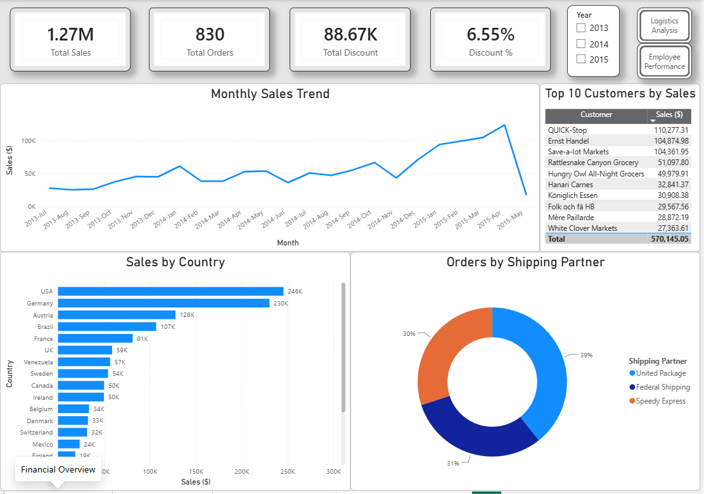
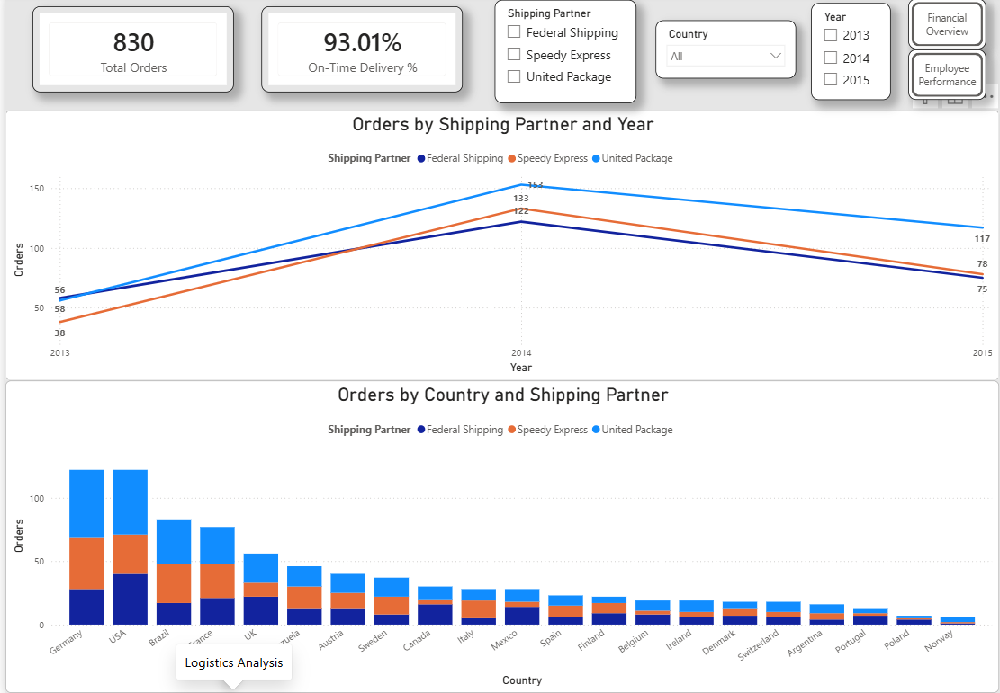
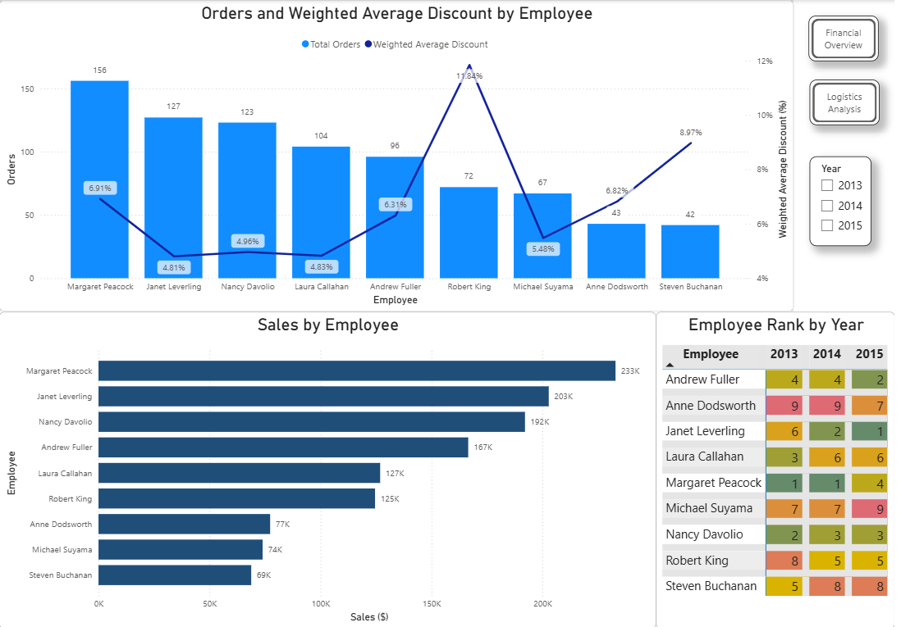
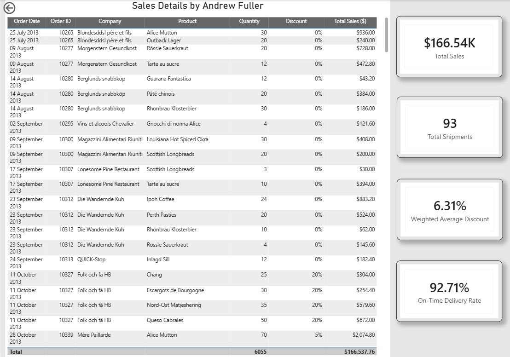

# Power BI Orders & Logistics Analysis

## Project Overview
This project focuses on analyzing orders and logistics performance using Power BI. The goal was to monitor key operational metrics, evaluate delivery performance, and identify important trends in orders and shipments.

## Tools
- Power BI
- Power Query
- DAX

## Analysis
- Analyzed orders and delivery performance
- Created key measures and KPIs using DAX
- Evaluated On-Time Delivery %
- Analyzed performance by carriers
- Analyzed orders by geographic location
- Evaluated employee performance
- Created Top 10 Customers analysis
- Used drill-through for detailed shipment analysis

## Dashboard
The interactive Power BI report provides a structured view of order performance, delivery efficiency, customer activity, and logistics metrics.

### Financial Overview

### Logistics Analysis

### Employee Performance

### Employee Sales Details

## Project File
`PowerBI_Orders_Logistics_Analysis.pbix`
